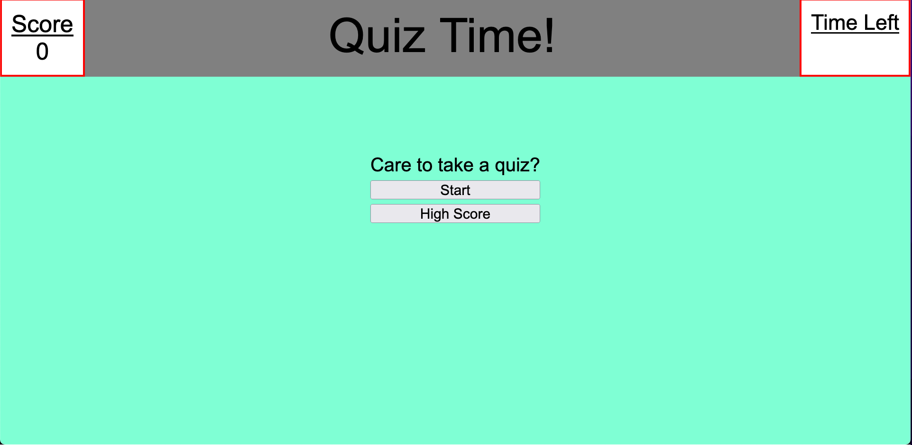
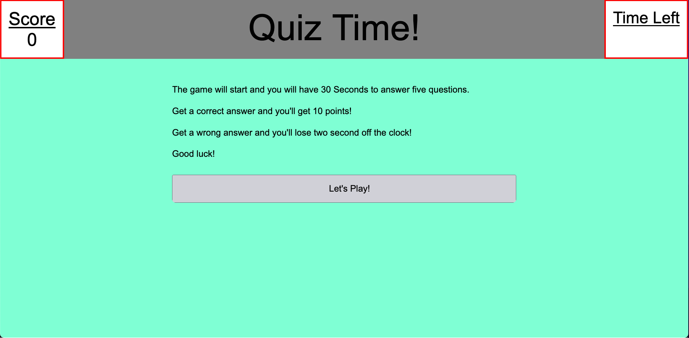
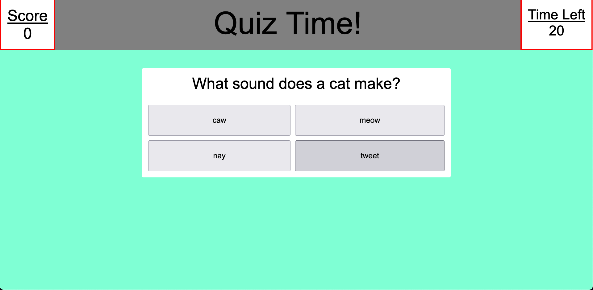

# challenge-4-quiz-game

  ## Table-of-Contents
  - [Description](#description)
  - [Installation](#installation)
  - [License](#license)
  - [Usage](#usage)
  - [Contribution](#contributing)
  - [Questions](#questions)
  
  ## Description 
  Want to test your knowlege of animal sounds? Well now you can with this fun and addicting triva game! Simply click start and try to solve as many
  questions before the time runs out! Don't forget to save your high score! 
  
  ## Installation 
  No installation needed just click the deployed link and have fun!
  
  ## License 
  [For more information about the license click here](https://choosealicense.com/licenses/mit/)
  
  ## Usage 
  Click the link below. and try to choose the right answer!
  
  ## Contribution 
  The repo is public so all are welcome to contribute if you’d like. Let me know if you’d like to help!
  
  ## Questions 
  If you have any questions at all feel free to contact me here or by email:
  
  [GitHub](https://github.com/jonrushing)

  [Email: jonrushingstuff@gmail.com](mailto:jonrushingstuff@gmail.com)

 Deployment Link:
(works with live sever??)

 https://jonrushing.github.io/challenge-4-quiz-game/
 
 
 
 
 
 
 
